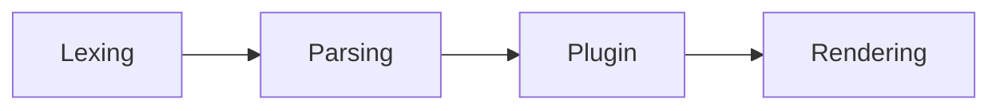

# Markdown Parser

> [Markdown](https://en.wikipedia.org/wiki/Markdown) is a lightweight markup language with plain text formatting syntax

## Roadmap

- [ ] lexing 
- [ ] parsing
- [ ] rendering
- [ ] plugin system
